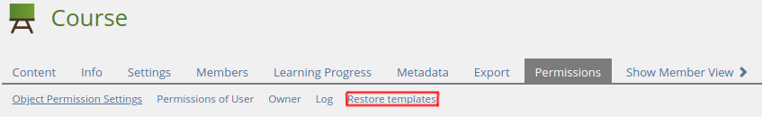
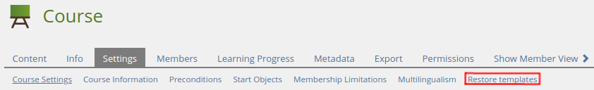
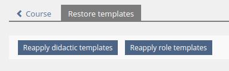

<!-- Autogenerated from composer.json - All changes will be overridden if generated again! -->

# SrRestoreRoleTemplatesUI ILIAS Plugin

Manually reapply didactic or role templates per object

This is an OpenSource project by studer + raimann ag, CH-Burgdorf (https://studer-raimann.ch)

This project is licensed under the GPL-3.0-only license

## Requirements

* ILIAS 5.4.0 - 6.999
* PHP >=7.0

## Installation

Start at your ILIAS root directory

```bash
mkdir -p Customizing/global/plugins/Services/UIComponent/UserInterfaceHook
cd Customizing/global/plugins/Services/UIComponent/UserInterfaceHook
git clone https://github.com/studer-raimann/SrRestoreRoleTemplatesUI.git SrRestoreRoleTemplatesUI
```

Update, activate and config the plugin in the ILIAS Plugin Administration

## Description

### Base plugin

First you need to install the [SrRestoreRoleTemplates](https://github.com/studer-raimann/SrRestoreRoleTemplates) plugin

You can disable its cron jobs if you don't wish it

### Permissions tab

You will find the plugin in the permissions tab for all object types



### Settings tab

For some core object types (Categories, courses, folders and groups), you will find it in the settings tab too



### Actions

You can run the actions from there

The 'Only objects created after' config does not affect here

Note: Reapply role templates is only available for courses



## Adjustment suggestions

* External users can report suggestions and bugs at https://plugins.studer-raimann.ch/goto.php?target=uihk_srsu_PLRRT
* Adjustment suggestions by pull requests via github

## ILIAS Plugin SLA

We love and live the philosophy of Open Source Software! Most of our developments, which we develop on behalf of customers or on our own account, are publicly available free of charge to all interested parties at https://github.com/studer-raimann.

Do you use one of our plugins professionally? Secure the timely availability of this plugin for the upcoming ILIAS versions via SLA. Please inform yourself under https://studer-raimann.ch/produkte/ilias-plugins/plugin-sla.

Please note that we only guarantee support and release maintenance for institutions that sign a SLA.
